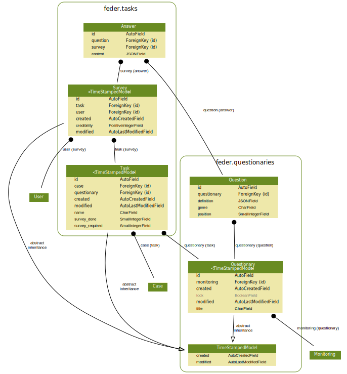

.. _tasks:

**************************
Zadania
**************************

Założenia
#########

Moduł stanowi komponent zlecenia dla użytkownika opracowania danego kwestionariusza w danym monitoringu. Utworzony winien być w danej sprawie w momencie, gdy istnieje w niej jakakolwiek korespondencja.

Encja "Task" (``Task`` ) stanowi indywidualne zlecenie wykonania opracowania informacji przesłanych przez urząd zgodnie z określonym kwestionariuszem.

Encja "Ankieta" (``Survey``) zapewnia zagregowanie informacji stanowiących wypełnienie przez danego użytkownika danego kwestionariusza, co stanowi realizacje wybranego zadania.

Encja "Odpowiedź" (``Answer``) stanowi odpowiedź na konkretne pytanie w danej ankiecie.

Relacje pomiędzy encjami modułu zadania i kwestionariusz został przedstawiony na diagramie:

Dane testowe
############

Dla modułu nie możliwe jest w środowisku deweloperskim dynamicznie wygenerowanie generowanych danych testowych.

 .. todo::
    Opracować generowanie danych testowych.

Architektura
############

Model
-----

.. automodule:: feder.tasks.models
   :members:

Panel administracyjny
---------------------

.. automodule:: feder.tasks.admin
   :members:

Widoki
--------------------

.. automodule:: feder.tasks.views
   :members:
